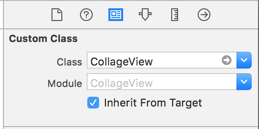

# CollageView
Custom View, collageView implementation with pure swift3.

This Library's aim is to make easily photo collage views.


## Usage

Like any other customViews, can be used with changing your view's class name as "CollageView" or initialize in code.

- Interface Builder

<p align="left">

</p>

```swift

class ViewController: UIViewController {

    //Assume that you have images array, or you can fetch from remote
    let images = [#imageLiteral(resourceName: "amsterdam"), #imageLiteral(resourceName: "istanbul"), #imageLiteral(resourceName: "camera"), #imageLiteral(resourceName: "istanbul2"), #imageLiteral(resourceName: "mirror")];

    @IBOutlet weak var collageView: CollageView!

    override func viewDidLoad() {
        super.viewDidLoad()
        // Set delegate to trigger click events on imageview's
        collageView.delegate    = self
        // Set datasource to fill your collageView with data
        collageView.dataSource  = self
    }

    deinit {
        collageView.delegate    = nil
        collageView.dataSource  = nil
    }

    override func didReceiveMemoryWarning() {
        super.didReceiveMemoryWarning()
    }
}
```

- Initialize in Code


```swift

class ViewController: UIViewController {

    //Assume that you have images array, or you can fetch from remote
    let images = [#imageLiteral(resourceName: "amsterdam"), #imageLiteral(resourceName: "istanbul"), #imageLiteral(resourceName: "camera"), #imageLiteral(resourceName: "istanbul2"), #imageLiteral(resourceName: "mirror")];

    var collageView = CollageView(frame: .zero)

    override func viewDidLoad() {
        super.viewDidLoad()

        view.addSubview(collageView)

        // Set delegate to trigger click events on imageview's
        collageView.delegate    = self
        // Set datasource to fill your collageView with data
        collageView.dataSource  = self
    }

    override func viewDidLayoutSubviews() {
        super.viewDidLayoutSubviews()
        // Example frame
        collageView.frame = view.bounds
    }

    deinit {
        collageView.delegate    = nil
        collageView.dataSource  = nil
    }

    override func didReceiveMemoryWarning() {
        super.didReceiveMemoryWarning()
    }
}
```

After that, fill required dataSource and optional delegate methods

```swift

extension ViewController: CollageViewDataSource {

    func collageViewNumberOfTotalItem(_ collageView: CollageView) -> Int {

        // total images count to show up
        return images.count
    }

    func collageViewNumberOfRowOrColoumn(_ collageView: CollageView) -> Int {

        // Sets number of total coloumn or row count of layout direction
        return 3
    }

    func collageViewLayoutDirection(_ collageView: CollageView) -> CollageViewLayoutDirection {

        // Sets the starting layout to fill images with
        // can be horizontol or vertical
        // if set to horizontal, first image rowIndex is (0, 0) and second one is (1, 0)
        // if set to vertical, first image rowIndex is (0, 0) and second one is (0, 1)

        return .horizontal
    }

    func collageView(_ collageView: CollageView, configure itemView: CollageItemImageView, at index: Int) {

        // MAGIC is in this code block
        // You can prepare your item here also,
        // You can fetch Images from Remote here!,
        // Customize UI for item, and etc..
        itemView.image = images[index]
        itemView.layer.borderWidth = 3
    }
}

extension ViewController: CollageViewDelegate {

    func collageView(_ collageView: CollageView, didSelect itemView: CollageItemImageView, at index: Int) {

        // Trigger click event of each image item
        let message = "didSelect at index:  \(index), rowIndex: \(String(describing: itemView.collageItem!.rowIndex))"
        print(message)
    }
}

```

## Installation

There are two ways to use CollageView in your project:
- using CocoaPods
- by cloning the project into your repository

### Installation with CocoaPods

[CocoaPods](http://cocoapods.org/) is a dependency manager for Swift and Objective-C, which automates and simplifies the process of using 3rd-party libraries in your projects. See the [Get Started](http://cocoapods.org/#get_started) section for more details.

#### Podfile
```ruby
platform :ios, '8.0'
use_frameworks!
pod 'CollageView', '~> 1.0.0'
```

## Author

Ahmet Kazım Günay, ahmetkgunay@gmail.com

## License

CollageView is available under the MIT license. See the LICENSE file for more info.

